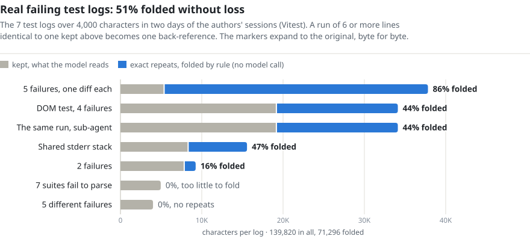
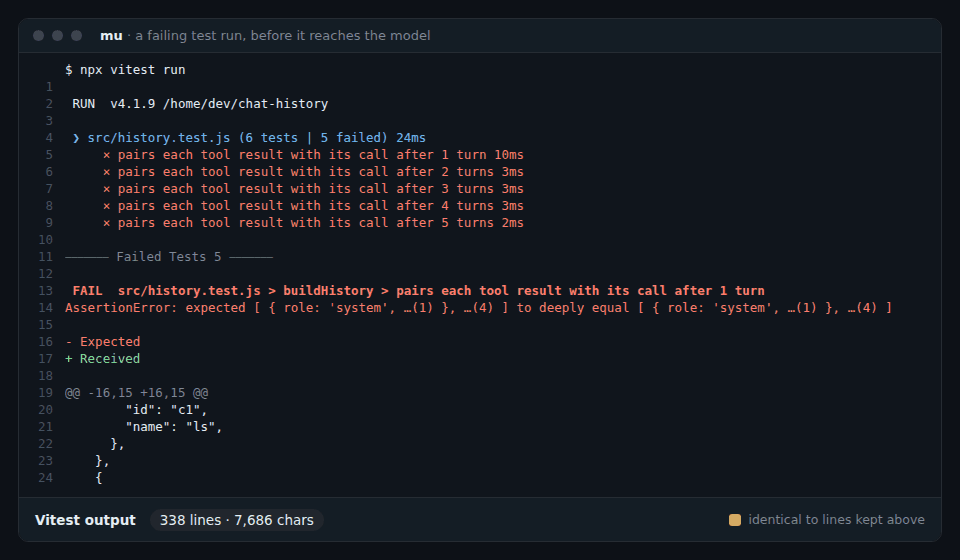
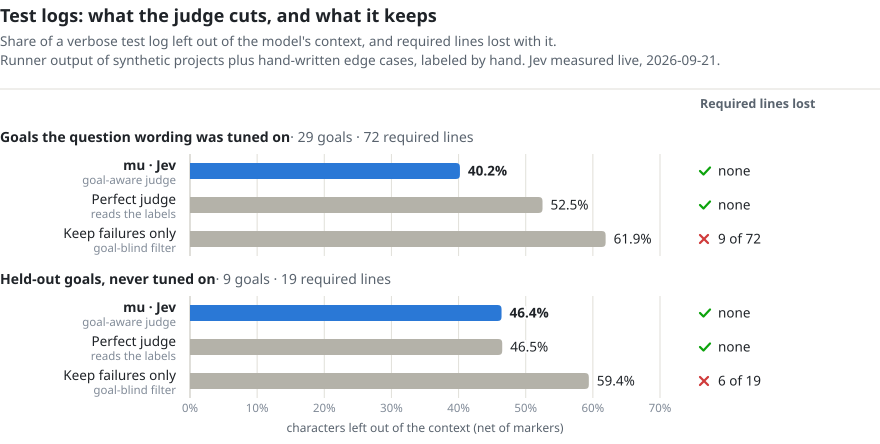

<p align="center">
  
</p>
<h1 align="center">mu</h1>
<p align="center">μ · Only what's needed.</p>
<p align="center">판정 커널을 갖춘 코딩 에이전트. <a href="https://github.com/earendil-works/pi">pi</a> 기반.</p>

<p align="center">
  <a href="https://github.com/qybaihe/mu/actions/workflows/ci.yml"></a>
  <a href="https://github.com/qybaihe/mu/actions/workflows/desktop.yml"></a>
  <a href="https://www.npmjs.com/package/mu-agent"></a>
</p>

<p align="center">
  <a href="../../README.md">English</a> · <a href="README.zh-CN.md">简体中文</a> · <a href="README.zh-TW.md">繁體中文</a> · <a href="README.ja.md">日本語</a> · <b>한국어</b>
</p>

코딩 에이전트는 세션 하나에서 코드와 상관없는 결정을 수백 번 내려요. 무엇을 컨텍스트에 남길지, 이 명령이 안전한지, 이 발견을 다른 에이전트에게 알릴 만한지, 일이 끝났는지. 큰 모델에 맡기면 토큰과 지연 시간, 주의력이 들어요. 고정된 규칙에 맡기면 너무 자주 틀려요. mu는 이런 결정을 **판정기**에 맡겨요. 판정기는 작고 빠른 모델로, 답의 범위가 정해진 질문에 한 번에 하나씩 답해요. 판정 지점은 턴마다 35개예요. 큰 모델은 주의력을 본래의 일에 쓸 수 있어요.

- **mu**: 명령줄 버전이에요. pi가 하는 모든 것에 판정 커널을 더했어요.
- **mu 데스크톱**: mu와 런타임이 들어 있는 네이티브 앱이에요. 내려받고, 모델을 연결하고, 시작하면 돼요.
- **Jev**: 판정기예요. 예/아니요, 선택, 점수 질문에 답하고, 답마다 확률을 붙이고, 모든 판정을 판정 장부에 남겨요. 로컬 판정기(Laya)나 어떤 LLM이든 Jev 대신 판정 지점을 맡을 수 있어요.

> 아직 초기 개발 단계예요. 프리릴리스(0.1.x)를 npm과 [Releases](https://github.com/qybaihe/mu/releases)에 올려 두었고, 만든 사람들은 매일 쓰고 있어요. 이름, 설정, 형식은 앞으로 바뀔 수 있어요.

## 한 턴의 흐름

```
 사용자 ──▶ input.preflight · task.frame · input.interjection
              │
              ▼
            모델 ──▶ 도구 호출 ──▶ tool.risk · tool.constraint · tool.approval ──▶ 실행
              ▲                                                                    │
              │    tool.admission   chunk by chunk: into the context, or archived behind a pointer
              │    context.forget · context.compact   when the context grows       │
              └────────────────────────────────────────────────────────────────────┘

 턴 종료 ──▶ turn.completion · turn.drift · turn.rewind · memory.applied · board.read · cache.warming
```

이름 하나하나가 판정 지점이에요. 판정 지점마다 작은 상태에 대한 짧은 질문을 하나 던져요. 그 답은 모델이 다음에 무엇을 할지를 바꿀 뿐, 여러분에게 물어볼지는 절대 바꾸지 않아요. 바닥은 규칙이 받쳐요. 위험해 보이는 명령은 규칙이 먼저 잡아내고, 판정기는 그게 정말 여러분이 원한 것인지 확인해 줄 뿐이에요.

## 판정 지점

판정 지점마다 `active`(켬), `shadow`(묻고 기록하지만 아무것도 바꾸지 않음. 판정기를 켜기 전에 비교해 보는 용도), `off`(끔) 중 하나로 둘 수 있고, 판정기도 따로 지정할 수 있어요: `jev`, `laya`(로컬), `classifier:<provider>/<model>`, `llm:<provider>/<model>`, 또는 `laya,jev` 같은 캐스케이드.

**입력**

| 판정 지점 | 질문 | 효과 |
| --- | --- | --- |
| `input.preflight` | 어떤 종류의 메시지이며, 얼마나 깊이 생각해야 하는가? | 모델에게 한 줄 힌트, 필요하면 이번 턴의 추론 수준도 정함 |
| `task.frame` | 새 작업인가, 반드시 지킬 제약인가, 정정인가, 하위 목표인가, 아니면 변화 없음인가? | 변화가 있을 때만 작업 프레임을 다시 씀: 목표, 여러분의 제약(원문 그대로, 출처와 함께), 인수 조건 |
| `input.interjection` | 에이전트가 일하는 중에 메시지가 옴: 지금 끊을까, 이 단계 뒤에 할까? | 턴을 끊거나, 메시지를 기다리게 함 |

**컨텍스트**

| 판정 지점 | 질문 | 효과 |
| --- | --- | --- |
| `skills.disclosure` | 이 작업과 관련 있는 스킬은 무엇인가? | 그 스킬만 프롬프트에 들어가고, 나머지는 찾으면 나오는 상태로 남음 |
| `capability.disclosure` | 이 작업에 설치된 팩이나 MCP 서버가 필요한가? | 필요할 때만 열고 프로세스를 시작함 |
| `tool.admission` | 긴 도구 출력의 청크마다: 지금 중요한가? | 중요한 것은 컨텍스트로, 나머지는 보관하고 포인터만 남김 |
| `tool.admission.test-log` | 테스트 로그에서 무엇이 반복인가? | 완전히 같은 반복은 무손실로 하나로 접음. 필요하면 나머지에서 판정기가 고름 |
| `context.forget` | 컨텍스트가 임계값을 넘으면, 어떤 도구 결과가 오래되었는가? | 나가는 요청에서 각각 한 줄짜리 툼스톤이 됨 |
| `context.compact` | 이 구간을 남길까, 잘라 낼까? | 판정에 따른 압축. 요약은 쓰지 않음 |
| `memory.recall` | 이 작업에 맞는 교훈은 무엇인가? | 이번 턴으로 가져옴 |
| `memory.capture` | 이 메시지는 에이전트를 바로잡는 것인가, 규칙을 정하는 것인가? | 교훈이 됨 |
| `memory.outcome` | 한참 헤맨 끝에 찾은 탈출구는 교훈으로 남길 만한가? | 여러분이 아니라 실행에서 얻은 교훈 |
| `memory.worth` | 모델이나 서브 에이전트가 제안한 교훈: 다시 쓸 만한가, 일회성인가, 이미 아는 것인가? | 남기거나 버림 |
| `memory.merge` | 기존 교훈과 같은가, 더 정확한가, 모순되는가? | 중복 없음. 더 정확한 쪽이 옛것을 대체함 |
| `memory.applied` | 불러온 교훈이 이번 턴에 지켜졌는가? | 자주 불려 나오지만 한 번도 지켜지지 않은 교훈은 사용 중지됨 |
| `cache.warming` | 프롬프트 캐시가 만료되기 전에 여러분이 돌아올 것인가? | 캐시를 갱신하거나, 만료되게 둠 |

**도구 및 안전**

| 판정 지점 | 질문 | 효과 |
| --- | --- | --- |
| `tool.risk` | 규칙에 걸린 명령: 여러분이 요청한 것인가? | 확신이 없으면 여러분에게 물어봄 |
| `tool.approval` | 'Jev 승인' 모드에서: 이 명령, 프로젝트 밖의 이 변경, 이 외부 동작, 이 서브 에이전트가 작업에 분명히 필요한가? | 확실한 것만 실행하고, 나머지는 여러분에게 물어봄 |
| `tool.constraint` | 무언가를 바꾸는 호출 전에: 여러분이 밝힌 제약을 넘는가? | 호출을 막음 |
| `files.locate` | 여러분의 설명에 맞는 파일은 무엇인가? | grep을 줄줄이 돌리는 대신 후보에 순위를 매김 |
| `browser.step` | 관찰, 판정 한 번, 실행: 다음 동작은 무엇이고, 어느 요소에 하는가? | 내장 브라우저가 한 단계 나아감 |
| `review.triage` | `/review`의 지적 사항마다: 동작을 바꾸는가, 이번 변경에 관한 것인가? | 지적 사항을 P0부터 P3까지 등급으로 나눔 |
| `diagnostics.delivery` | 편집 후 새로 생긴 언어 서버 진단: 지금 알릴까, 다음에 멈출 때 알릴까, 알리지 말까? | 오류는 모델에게 전달, 스타일 경고는 전달하지 않음 |

**턴**

| 판정 지점 | 질문 | 효과 |
| --- | --- | --- |
| `turn.drift` | 몇 단계마다: 작업이 아직 목표를 향하고 있는가? | 제자리걸음은 규칙이, 옆길로 새는 것은 판정기가 잡아냄 |
| `turn.rewind` | 같은 실패가 계속 반복됨: 이 방법은 막다른 길인가? | 체크포인트로 되돌아감 |
| `turn.completion` | 모델이 다 했다고 함: 그걸 검증한 것이 있는가? | 없으면 한 번 짚어 줌 |
| `output.drift` | 모델이 쓰는 동안: 출력의 끝부분이 여러분의 제약을 넘는가? | 실험적. 쓰는 도중에 바로잡음 |
| `goal.met` | 목표 모드에서 큰 모델이 답을 내지 못할 때: 조건이 충족되었는가? | `/goal`의 폴백 |
| `board.read` | 일이 어디까지 왔는가(객관식)? | 쉬운 말 보드에 쓰임 |
| `notify.routing` | 컨텍스트 예산 같은 이벤트: 모델에게 지금 알릴까, 나중에 알릴까, 알리지 말까? | 알맞은 때에 모델에게 알림 |

**협업**

| 판정 지점 | 질문 | 효과 |
| --- | --- | --- |
| `swarm.routing` | 위임한 이 작업에는 어떤 역할, 어떤 모델 등급, 어떤 추론 수준이 맞는가? | 딱 맞는 서브 에이전트 |
| `swarm.patch` | 서브 에이전트의 패치가 작업 범위 안에 머물렀는가? | 작업, 경로, 줄 수로 판정 |
| `hive.publish` | 비(bee)의 발견이 공유 보드에 올릴 만한가? | 게시하거나, 혼자 간직함 |
| `hive.deliver` | 보드의 메모가 이 비의 작업과 관련 있는가? | 관련 있을 때만 전달 |
| `hive.relate` | 새 발견이 앞선 발견을 뒤집는가, 모순되는가, 뒷받침하는가? | 정정과 이견이 옛 메모를 가진 비에게 전달됨 |

## 판정기

- **Jev**(클라우드). 답의 범위가 정해진 질문에 확률과 함께 답해요. TypeSafe, OpenRouter, Vercel AI Gateway, OpenCode Zen, Cloudflare Workers AI, 또는 같은 프로토콜을 쓰는 어떤 서비스로든 부를 수 있고, 서비스마다 키가 따로 있어요(`TYPESAFE_API_KEY`, `MU_JUDGE_OPENROUTER_API_KEY`, `AI_GATEWAY_API_KEY`, `OPENCODE_API_KEY`, `CLOUDFLARE_API_KEY`와 `CLOUDFLARE_ACCOUNT_ID`). 데스크톱 앱의 '판정기' 페이지에서 고를 수 있고, 기본값은 키가 설정된 첫 번째 서비스예요. 키가 하나도 없으면 `jev-opencode-free`로 OpenCode Zen의 Jev 1.13을 기간 한정 무료로 쓸 수 있어요. 만든 사람들의 실제 세션에서 잰 값으로, HTTP/2 웜 연결에서 질문 하나에 약 0.3초, 도구 출력 16청크를 요청 하나로 판정하는 데 0.44초가 걸렸고, 상태는 한 번만 과금됐어요. 판정, 확률, 소요 시간은 판정 장부에 남아요. `mu ledger`나 데스크톱 앱의 '판정' 탭에서 볼 수 있어요.
- **Laya**(로컬). 여러분의 컴퓨터에서 돌아가고 네트워크에는 전혀 닿지 않는 322M 파라미터 판정기예요. 여러분이 동의하지 않으면 아무것도 내려받지 않아요. 단순한 술어에는 믿을 만하지만 메타 판단에는 약한 편이에요. 판정 지점을 맡기기 전에 섀도 모드로 Jev와 나란히 돌려 보고 판정 장부를 읽어 보세요.
- **pi 모델 카탈로그의 어떤 분류 모델이든** 계층 하나로 쓸 수 있어요: `classifier:<provider>/<model>`. Cloudflare의 Clef(`clef`, `clef-flash`), OpenRouter와 Vercel AI Gateway의 System One 모델, llama.cpp 분류 모델 등.
- **어떤 LLM이든** 계층 하나로 쓸 수 있어요: `llm:<provider>/<model>`.

만든 사람들의 실제 세션에서 얻은 효과예요. 도구 출력이 청크 단위로 들어오고 오래된 결과는 요약 없이 내려놓기 때문에 컨텍스트가 가득 차지 않아요. 가장 긴 실패 테스트 로그들에서는 완전히 같은 반복을 접어서 글자 수가 51% 줄었고, 잃은 글자는 하나도 없어요([실측](#실측) 참고). 커널이 여러분이 언제 돌아올지 가늠하기 때문에 프롬프트 캐시가 웜 상태로 유지돼요.

## 실측

아래 숫자는 저장소에 들어 있는 리플레이 [`kyrn/spikes/judge-bench/test-log-replay.ts`](../../kyrn/spikes/judge-bench/test-log-replay.ts)에서 나왔어요. 방법과 전체 표는 [kyrn/docs/09-test-log-admission.md](../../kyrn/docs/09-test-log-admission.md)(중국어)에 있어요.

**완전히 같은 반복.** 실패한 실행은 실패한 테스트마다 같은 diff, DOM 덤프, 스택을 한 번씩 출력하곤 해요. mu는 첫 번째 것을 남기고, 그 뒤의 반복은 어느 줄을 반복하는지 적은 한 줄로 바꿔요. 모델은 부르지 않아요. 표시를 펼치면 원래 로그와 바이트 단위로 같고, 전체 로그는 디스크에 남아 있으며 출력 끝에 그 위치가 적혀요.

<p align="center">
  <picture>
    <source media="(prefers-color-scheme: dark)" srcset="bench-test-log-repeats-dark.svg">
    
  </picture>
</p>

<p align="center"></p>

**목표에 따른 선별.** 자세한 리포터를 쓰면 무엇을 남길지는 여러분이 무엇을 물었는지에 달려 있어요. 실패를 디버깅할 때 통과한 테스트는 잡음이지만, 어떤 테스트가 실행됐는지 물을 때는 증거예요. Jev는 요청 하나로, 통과한 테스트 블록과 테스트 출력 블록마다 "목표에 아직 필요한가?"를 질문받아요. 요약과 모든 실패는 질문 대상이 아니에요. Jev가 "필요 없음"에 0.9 이상의 확률을 줄 때만 그 블록을 빼요.

<p align="center">
  <picture>
    <source media="(prefers-color-scheme: dark)" srcset="bench-test-log-judge-dark.svg">
    
  </picture>
</p>

*Perfect judge*(완벽한 판정기)는 레이블을 직접 읽어요. 올바른 판정기가 줄일 수 있는 최대치예요. *Keep failures only*(실패만 남기기)는 늘 "빼라"고 답하는 판정기로, 목표를 보지 않는 필터가 하는 일과 같아요. 이 조사에서 실제로 보낸 Jev 요청은 모두 282건이고, 정가로 약 $0.017이었어요. 기본 질문 방식에서 요청 하나의 소요 시간 중앙값은 345ms예요.

둘 다 기본값은 꺼짐이에요. `~/.mu/agent/mu.json`에 `"features": { "admission": { "testLog": "rules" } }`를 쓰거나 데스크톱 앱 설정에서 '테스트 로그 정리'를 켜면 반복이 접혀요. `"jev"`로 하면 선별이 더해지는데, `/mu mode tool.admission.test-log active`를 실행하기 전까지는 섀도(질문하고 기록만 하고, 아무것도 바꾸지 않음)로 돌아가요.

이 숫자가 말해 주지 않는 것:

- 선별 사례는 합성 프로젝트에서 실제로 나온 Vitest, node:test, pytest 출력에 손으로 쓴 경계 사례 13개를 더한 것이에요. 목표와 레이블은 만든 사람들이 썼어요. 조정에 쓰지 않은 목표는 먼저 레이블을 붙이고 한 번만 돌렸고, 그 뒤로 아무것도 바꾸지 않았어요.
- 무엇이 모델에 들어가고 무엇을 잃었는지를 잰 것이지, 그다음 모델이 작업을 끝냈는지를 잰 것이 아니에요.
- 반복 데이터는 개발자 한 명의 이틀 치 세션에서 나왔어요. 테스트 로그 15개, 모두 Vitest이고, 그래프는 그중 4,000자가 넘는 7개예요. 다른 테스트 러너는 재지 않았어요.
- 같은 작업으로 pi, Claude Code, Codex와 엔드투엔드로 비교한 결과는 아직 없어요.

`node kyrn/spikes/judge-bench/test-log-replay.ts`를 실행하면 Jev를 뺀 모든 조건을 키 없이 몇 초 만에 다시 돌려요. 현재 코드에서는 이 조건들이 그래프보다 0.6~1.1포인트 높게 나와요. 그래프는 2026-09-21에 잰 값이에요. Jev 조건에는 `TYPESAFE_API_KEY`가 필요해요.

<details>
<summary>그래프의 데이터</summary>

| 목표에 따른 선별 | 조정에 쓴 목표(29): 줄인 비율 | 잃은 필요한 줄 | 조정에 쓰지 않은 목표(9): 줄인 비율 | 잃은 필요한 줄 |
| --- | --- | --- | --- | --- |
| mu · Jev | 40.2% | 72개 중 0개 | 46.4% | 19개 중 0개 |
| 완벽한 판정기 | 52.5% | 72개 중 0개 | 46.5% | 19개 중 0개 |
| 실패만 남기기 | 61.9% | 72개 중 9개 | 59.4% | 19개 중 6개 |

| 실제 실패 테스트 로그 | 글자 수 | 접힘 |
| --- | --- | --- |
| 실패 5개, 각각 diff 하나씩 | 37,819 | 86% |
| DOM 테스트, 실패 4개 | 34,115 | 44% |
| 같은 실행을 서브 에이전트가 본 것 | 34,115 | 44% |
| 공유된 stderr 스택 | 15,565 | 47% |
| 실패 2개 | 9,249 | 16% |
| 스위트 7개가 파싱에 실패 | 4,953 | 0%: 반복이 하나뿐이고, 접기에는 너무 짧음 |
| 서로 다른 실패 5개 | 4,004 | 0%: 반복 없음 |
| 7개 합계 | 139,820 | 51.0% |

</details>

## 하이브

멀티 에이전트 시스템은 모두 같은 질문에 답해요. 한 에이전트가 아는 것을 다른 에이전트에게 알려야 할까요? 흔한 답은 아무것도 넘기지 않기(메인 에이전트에게만 보고), 전부 넘기기(그룹 채팅이나 인수인계 때 전체 기록을 통째로), 각 에이전트의 큰 모델에 맡기기, 아니면 고정된 규칙과 환경에 기대기예요. mu의 답은 판정기를 문지기로 세우는 거예요.

하이브는 비 2마리에서 6마리로 이루어지고, 비마다 자기 관심사가 있어요. 비는 코드를 읽고, 명령을 실행하고, 브라우저를 쓰지만, 코드를 고치지는 않아요. 변경은 메인 모델이 해요. 비가 말을 한 차례 마칠 때마다 `hive.publish`가 한 번 물어요. 여기에 공유할 만한 발견, 막다른 길, 결정, 블로커가 있는가? 공유할 만한 것은 추가만 되는 공유 보드에 올라가요. 새 메모가 올라올 때마다 `hive.deliver`가 다른 비 하나하나에 대해 한 번씩 물어요. 이것이 그 비의 관심사와 닿아 있는가? 그렇다면 메모에 "지시가 아니라 발견"이라고 표시해서 전달해요.

보드는 쌓이기만 하기 때문에, 나중 결론이 앞선 결론을 뒤집을 수 있어요. 어떤 비가 테스트가 안 돌아간다고 보고했다가, 환경 변수 하나를 지우고 나서 돌아가게 만드는 식이에요. `hive.relate`는 두 메모 사이의 관계를 읽어요. '뒤집음', '모순', '뒷받침' 중 하나예요. 뒤집힌 결론은 정정이 되어 옛 결론을 가진 모든 비에게 전달돼요. 서로 모순되는 두 메모는 둘 다 남고 이견으로 표시돼요. 1분 안에 아무도 결론을 내지 않으면 검증 비를 보내요.

<p align="center"></p>

이 모든 일이 벌어지는 현장이 데스크톱 앱의 하이브 탭이에요. 비마다 한 줄씩 역할, 모델, 지금 하는 일이나 방금 한 말을 보여 줘요. 지도에는 누가 누구에게 발견을 전달했는지가 그려져요. 전달이 많을수록 선이 굵고, 정정과 이견은 각자 따로 표시되며, 발견이 도착하는 순간 그 선이 빛나요. 정보 흐름에는 전달된 메시지의 원문이 모두 있고, 판정 기록에는 모든 판정이 있어요. 대화 안의 하이브 카드에는 작은 지도가 들어 있고, 누르면 이 탭이 열려요.

실제 실행 한 번을 예로 들면, 비 3마리가 9분 동안 일하는 사이 후보 117개를 판정했고, 27개가 보드에 올라갔고, 16개가 그것을 필요로 하는 비에게 전달됐어요. 모든 판정은 실행 로그에 있어요.

`/swarm`은 비마다 무엇을 하는지 보여 주고, `/swarm stop`은 지금 바로 보고를 요청하고, `/swarm kill`은 비들을 끝내요. 시간이 다 된 비에게는 보고를 요청하고, 보고가 없으면 끝내요. 멈춰 버린 모델이나 도구는 워치독이 처리해요. 하이브는 언제나 돌아와요.

## 쉬운 말 보드

프런티어 모델은 일은 더 잘하게 되는데, 그 일에 대해 말하는 건 더 서툴러져요. 세대가 바뀔수록 진행 보고는 다른 기계가 읽을 출력에 가까워지고, 더 빽빽하고 더 불투명해져서 사람이 하는 말과는 멀어져요. mu는 일하는 모델에게 스스로 보고하게 하지 않아요. 보드를 켜 두면(`/board`, 또는 데스크톱 앱 보드 탭의 스위치), 에이전트가 한 걸음 뗄 때마다 보드에 쉬운 말 한 줄이 바로 붙어요. 어떤 파일을 바꿨는지, 검증이 통과했는지 실패했는지, 어떤 명령을 실행했는지요. 파일을 연달아 읽으면 「파일 N개를 봤어요」 한 줄로 접히고 숫자만 올라가요. 일하는 도중에 에이전트가 무언가 말할 때마다 `board.read`가 판정기에게 그게 새 소식인지 물어요. 새 소식이면, 쉽게 말한다는 한 가지 이유만으로 고른 모델(`/board model`)이 그 자리에서 사람에게 다시 말해 주고, 보드의 현재 상태도 함께 갱신해요. 지금 무엇을 하고 있는지, 체크리스트 항목 중 몇 개가 끝났는지, 여러분을 기다리는 것이 무엇인지요. 실행이 끝났을 때의 요약은 기록의 마지막 줄이 되고, 과정은 그 위에 남아요. 그래서 「끝났다」만이 아니라, 무엇을 했는지가 늘 보여요.

<p align="center"></p>

일하는 모델은 일할 때 자기 언어를 그대로 쓰고, 보드에 나오는 글은 언제나 한눈에 읽을 수 있어요. 보드는 권한 모드, 목표, 서브 에이전트를 따라가고, 에이전트가 방향을 바꾸면 보드의 표현도 바뀌어요. 맨 위의 두 숫자는 컨텍스트 사용량과 캐시 적중률로, 위에서 본 컨텍스트와 캐시 판정의 직접적인 결과예요.

## 데스크톱 앱

mu와 런타임이 들어 있는 네이티브 앱이에요. Node를 설치할 필요가 없고, 처음 실행할 때도 아무것도 내려받지 않아요. 명령줄에 있는 것은 모두 있고, 여기에 대화 옆 작업 패널이 더해져요.

**보드** · **판정**(실시간 판정 장부: 모든 판정과 그 질문) · **하이브** · **교훈** · **파일** · **미리보기** · **소스** · **브라우저**(에이전트가 한 단계씩 조작하는 내장 브라우저. 목표, 일시 정지, 중지 포함)

권한 모드와 목표는 입력창에 있고, `⌘K`로 명령어 팔레트를 열어요. 모델 로그인은 앱 안에서 해요. ChatGPT, Claude, Grok, Google(Gemini CLI / Antigravity) 구독이나, pi가 지원하는 어떤 프로바이더의 API 키든 쓸 수 있어요. Claude Code와 Codex CLI의 대화는 가져와서 이어 갈 수 있어요.

macOS(Apple 실리콘 / Intel), Windows(x64 / Arm), Linux(x64 / Arm)용 빌드는 GitHub Actions에서 만들어 [Releases](https://github.com/qybaihe/mu/releases)에 올려요.

## 명령줄

```bash
npm i -g mu-agent
mu            # 현재 디렉터리에서 대화형 세션 시작
mu doctor     # 설치, 판정기, 연결 상태 점검
```

Node 22.19 이상이 필요해요. `mu -p "prompt"`는 한 번 실행하고 결과를 출력하고, `mu -c`는 마지막 세션을 이어 가요. `mu import --list`는 Claude Code와 Codex 대화를 찾아 주고, `mu import <file>`은 그 대화를 가져와요. `mu ledger [n]`은 최근 n개 세션에서 판정기가 내린 판정을 출력해요. 명령줄과 데스크톱 앱은 계정, 설정, 교훈을 함께 써요.

| 명령어 | 하는 일 |
| --- | --- |
| `/status` | 판정기, 판정 지점별 모드, 컨텍스트에서 뺀 것, 최근 판정 |
| `/mu judge <judges>` | 어떤 판정기가 어떤 순서로 답할지: `laya`, `laya,jev`, `jev-opencode-free`, `classifier:<provider>/<model>`, `llm:<provider>/<model>` |
| `/mu route <point> <judge>` | 판정 지점 하나에 따로 판정기를 지정하기 |
| `/mu mode <point> <off\|shadow\|active>` | 판정 지점 하나를 전환하기 |
| `/frame` | 작업 프레임: 목표, 여러분의 제약과 그 출처, 인수 조건 |
| `/goal <condition>` | 조건이 충족될 때까지 계속 작업하기, `/goal clear`로 끝내기 |
| `/permissions` | 전체 접근 / Jev 승인 / 최소 권한 |
| `/board` | 쉬운 말 보드 켜고 끄기 |
| `/remember`, `/lessons`, `/forget` | 교훈 하나 남기기, 목록 보기, 하나 사용 중지하기 |
| `/review`, `/commit` | 변경 사항을 리뷰하고 지적 사항을 P0부터 P3까지 나누기, 커밋 작성하기 |
| `/checkpoints`, `/rewind` | 체크포인트 목록 보기, 그중 하나로 되돌아가기 |
| `/agents`, `/swarm` | 서브 에이전트 보내기, 일하는 비를 하나하나 지켜보기 |
| `/browse`, `/jobs` | 내장 브라우저, 백그라운드 작업 |
| `/capabilities`, `/ledger` | 설치된 기능 확장과 그중 열린 것, 최근 판정 |
| `/import-chat` | Claude Code 또는 Codex 대화 가져오기 |
| `/doctor` | 설정과 연결 점검하기 |

pi의 자체 명령(`/model`, `/thinking`, `/login`, `/resume`, `/tree`, `/fork`, `/compact`, `/export` 등)은 그대로예요. `MU_JUDGE=laya,jev mu`로 실행하면 그 실행에서만 판정기를 바꿀 수 있어요.

## 프라이버시

키는 이 컴퓨터를 떠나지 않아요. mu는 모델이나 런타임을 스스로 내려받지 않고, 내려받아야 하는 것은 모두 먼저 물어봐요. 판정기는 질문에 필요한 필드만 봐요. 모든 판정은 로컬에 기록되고, 전부 읽어 볼 수 있어요.

## 개발

```bash
npm install --ignore-scripts   # 의존성 설치, 라이프사이클 스크립트는 실행하지 않음
npm run check                  # 포맷, 린트, 타입 검사
./test.sh                      # 테스트 (모델이 필요한 테스트는 키가 없으면 건너뜀)
```

데스크톱 앱은 `desktop/`에 있어요. `bun install` 다음에 `KYRN_ROOT="$(cd .. && pwd)" bun run start`를 실행하면 이 저장소의 mu를 쓰는 개발 빌드가 시작돼요(먼저 루트에서 `npm install`을 실행하세요). 구조와 기여 규칙: [AGENTS.md](../../AGENTS.md).

## 출처와 라이선스

mu는 [pi](https://github.com/earendil-works/pi)(코딩 에이전트, MIT; 루트의 [LICENSE](../../LICENSE)가 `packages/`와 `kyrn/`에 적용)와 [AionUi](https://github.com/iOfficeAI/AionUi)(데스크톱 앱, Apache 2.0; `desktop/`에는 AionUi의 [LICENSE](../../desktop/LICENSE)를 그대로 둠)를 바탕으로 만들었어요. 두 프로젝트에 감사드려요. 판정 커널에 쓰인 서드파티 코드는 [THIRD_PARTY_NOTICES.md](../../packages/kyrn-judge/THIRD_PARTY_NOTICES.md)에 정리되어 있어요.

## 커뮤니티

버그 제보와 요청: [GitHub Issues](https://github.com/qybaihe/mu/issues). 토론(중국어): [linux.do](https://linux.do)
